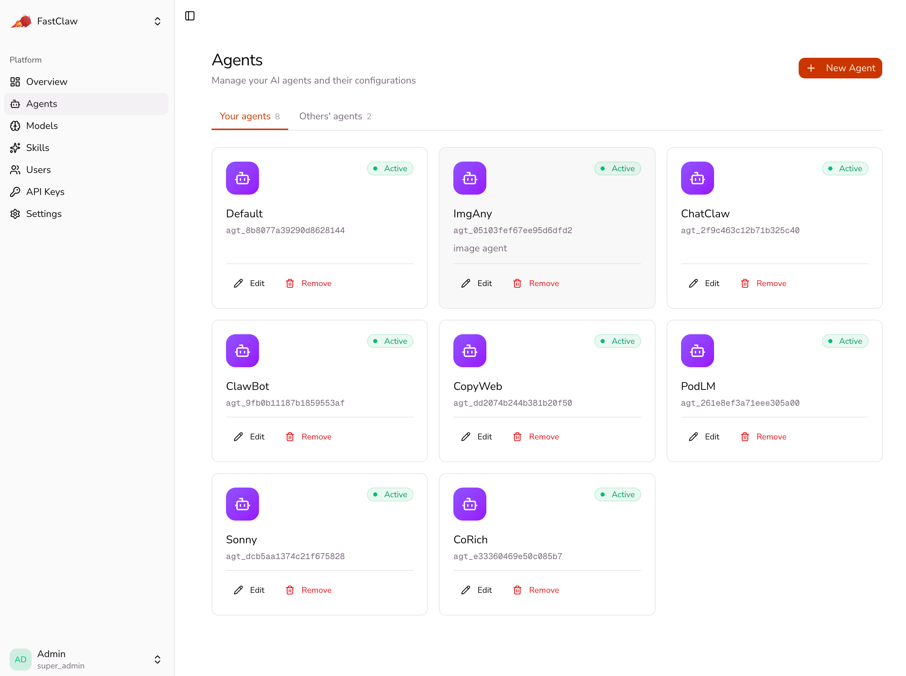
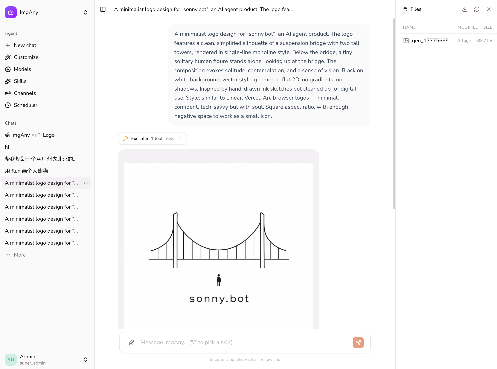

<div align="center">

# FastAgent

A lightweight AI Agent runtime written in Go.

[](https://go.dev)

**Single binary - Any LLM - Multi-agent - Sandbox - Cloud-ready**

[Quick Start](#quick-start) - [Architecture](#architecture) - [Features](#features) - [License](#license)

</div>

---

<p align="center">
  
  <br>
  <em>Platform admin: agents, models, skills, users, API keys</em>
</p>

<p align="center">
  
  <br>
  <em>Per-agent management: chat, customize, scoped models / skills / channels / scheduler</em>
</p>

## What is FastAgent?

FastAgent is an **Agent Factory** — it creates, manages, and runs AI agents. Each agent has its own personality (SOUL.md), memory, skills, and tools. FastAgent handles the LLM communication, tool execution, sandbox isolation, and session management.

```bash
# Install (drops the binary into ~/.local/bin and adds it to PATH)
curl -fsSL https://raw.githubusercontent.com/tokenaissance/fastagent/main/install.sh | bash
```

## Quick Start

### 1. First Run

```bash
fastagent
# Opens setup wizard → configure LLM provider → creates default agent.
# Foreground mode; ^C to stop. Use `fastagent daemon start` to run in
# the background, or `fastagent daemon install` to register a
# launchd / systemd service.
```

### 2. Dashboard

Open `http://localhost:18953` and login with your admin token.

- **Agents** — Create and manage agents, each with its own personality and model
- **Skills** — Install shared skills from ClawHub or GitHub
- **Models** — Configure LLM providers (OpenAI, Anthropic, Ollama, OpenRouter, etc.)
- **API Keys** — Issue programmatic credentials (admin / user / agent tiers)
- **Settings** — General (theme), Account (profile + password), Runtime (sandbox config; admin only)

> Non-admin users get scoped access to **Models**, **API Keys**, and
> **Settings (General + Account)** out of the box. They see admin-shared
> resources as `Inherited` and can layer their own private overlays on
> top — same inheritance pattern the agent runtime uses.

### 3. Agent Management

Click an agent to enter its management panel:

- **Chat** — Talk to the agent (debug/test)
- **Files** — Edit SOUL.md, IDENTITY.md, MEMORY.md, etc.
- **Skills** — Agent-private skills
- **Models** — Agent-specific provider + model overrides (shadow system entries by name; agent-scope `agents.defaults.model` overrides the system default)
- **Channels** — Connect IM bots (Telegram, Discord, Slack) so end-users can chat with the agent on their platform of choice
- **Scheduler** — Inspect and manage cron jobs the agent created via `create_cron_job` ("每天 9 点提醒我", "5 分钟后叫我"); pause / delete from the UI
- **Sessions** — Conversation history

**Sharing.** Each agent has a `Public access` toggle in the Edit dialog
(default off). When on, anyone with the chat URL — `/agents/{id}/chat/`
— can chat with the agent under their own account; sessions / memory /
USER.md partition per chatter, while SOUL / IDENTITY / skills are
shared from the owner's row. When off, only the owner (or super_admin)
can access it.

## Architecture

```
~/.fastagent/
  fastagent.db                # SQLite default — users, agents, sessions,
                             # apikeys, configs, agent_files all live here
  skills/                    # Shared skills (bundled + installed)
  agents/
    <agentId>/agent/skills/        # Agent-private skills (filesystem only)
```

The database is the source of truth for everything except skill folders
on disk. SQLite is the default; point `FASTAGENT_STORAGE_DSN` at Postgres
for multi-pod deployments.

**There is no `fastagent.json`.** Bootstrap settings (port, bind, storage
DSN, sandbox backend) come from `FASTAGENT_*` env vars; everything user-
facing (providers, channels, settings, defaults) lives in the `configs`
table and is edited through the dashboard or `fastagent agents config`.

### What FastAgent Stores

| Data | Belongs to | Backing store |
|------|-----------|---------------|
| Agent records, SOUL.md / IDENTITY.md / MEMORY.md / agent.json | Agent | DB (`agent_files` table) |
| Sessions (chat history) | Agent × user | DB (`sessions` table) |
| API keys, users, scoped configs (providers/channels/settings) | Platform | DB |
| Skills | Agent / Global | Filesystem (`skills/`, `agents/<id>/agent/skills/`) |
| User accounts, billing | Application | Your app (ChatClaw, etc.) |
| Output files | Application | Your app / S3 |

## Features

### LLM Providers
- OpenAI, Anthropic, Ollama, OpenRouter, Groq, DeepSeek, Mistral, and any OpenAI-compatible API
- Per-agent provider + model override (agent-scope shadows system by name)
- Prompt cache support (RawAssistant preservation)

### Channels
- Per-agent Telegram / Discord / Slack bot bindings — end-users chat with the agent on their platform
- Tokens validated before save (Telegram `getMe`, Discord `/users/@me`, Slack `auth.test`)
- Sessions are isolated per channel + chatID, so a user's Telegram thread and Discord thread stay separate

### Tools & Sandbox
- Built-in: exec, read_file, write_file, list_dir, web_fetch, web_search, memory_search
- E2B cloud sandbox or Docker sandbox — automatic skill + workspace hydrate, post-exec sync (sandbox-side files mirrored back to the durable store after every tool call)
- MCP server support
- Plugin system (JSON-RPC subprocess)

### Skills
- Bundled skills: code-runner, image-gen, data-analysis, translation, web-search, skill-creator
- Install from [ClawHub](https://clawhub.ai) or [skills.sh](https://skills.sh)
- Agent-private or globally shared

### Memory
- MEMORY.md — long-term facts, auto-updated by heartbeat
- Session-based context with full history preservation
- Thinking/reasoning content preserved for memory extraction

### API
- OpenAI-compatible `/v1/chat/completions` (streaming)
- Web chat `/api/chat/stream` (SSE)
- Live agent push via `/api/chat/subscribe` (SSE) — surfaces cron-fired and other async replies into the open chat panel without a refresh
- Session management `/api/chat/sessions`
- Agent CRUD `/api/agents` (`?all=true` returns the cross-tenant view, admin-only)
- Per-agent scheduler `/api/agents/{id}/cron` (list / toggle / delete)
- Provider management `/api/config`
- Skill install `/api/skills/install` (ClawHub + GitHub)
- API key management `/api/apikeys` (per-user; tiers: admin / user / agent)
- User management `/api/users` (admin) — top-level CRUD + nested
  `/api/users/{id}/apikeys` and `/api/users/{id}/agents` for
  admin-driven provisioning. The `agents` endpoint accepts
  `forkFrom` to clone an existing agent's identity (SOUL / IDENTITY /
  skills / model defaults) into the new user's namespace — primary
  building block for "user buys a bot" flows. Per-user `agent_quota`
  caps how many agents a non-admin can self-create
  (`-1` = unlimited, `0` = admin-provisioned only).
- App-user provisioning `POST /v1/users` — third-party apps mint a stable fastagent user_id per end-user, idempotent on `(api_key, external_id)`. Or pass `user` on `/v1/chat/completions` (or `X-Fastagent-End-User` header) for lazy mint on first call

## Configuration

Bootstrap is **env-only**. Everything that needs to change at runtime
(providers, models, channels, defaults, sandbox toggle) lives in the
database and is edited through the dashboard or `fastagent agents config`.

| Env var | Default | What it does |
|---|---|---|
| `FASTAGENT_HOME` | `~/.fastagent` | Where the SQLite DB and skill folders live. |
| `FASTAGENT_PORT` | `18953` | Gateway HTTP port. |
| `FASTAGENT_BIND` | `loopback` | `loopback` (127.0.0.1) or `all` (0.0.0.0). |
| `FASTAGENT_STORAGE_TYPE` | `sqlite` | `sqlite` or `postgres`. |
| `FASTAGENT_STORAGE_DSN` | empty | Postgres DSN, e.g. `postgres://u:p@host:5432/db?sslmode=disable`. Empty = sqlite at `$FASTAGENT_HOME/fastagent.db`. |
| `FASTAGENT_STORAGE_AUTO_MIGRATE` | `true` | Apply schema migrations on boot. |
| `FASTAGENT_SANDBOX_ENABLED` | dashboard | Override the Settings → Runtime toggle. |
| `FASTAGENT_SANDBOX_BACKEND` | dashboard | `docker` or `e2b`. |
| `FASTAGENT_SANDBOX_IMAGE` | dashboard | Docker image (Docker backend) or template id (E2B). |
| `FASTAGENT_OBJECT_STORE_*` | unset | S3-compatible blob store for distributed deploys (multi-pod skill / file hydration). |
| `FASTAGENT_LOG_LEVEL` | `info` | `debug` / `info` / `warn` / `error`. |
| `FASTAGENT_WEBHOOK_URL` | unset | Webhook endpoint for usage billing integration (e.g., `https://cloud.example.com/api/fastagent/webhooks/usage`). |
| `FASTAGENT_WEBHOOK_TOKEN` | unset | Authentication token for webhook requests (Bearer token). |

Anything not on this list — providers, models, default model, skill
catalog, channels, plugin config, scheduler — is configured at runtime
through the web UI (`http://localhost:18953`) or the CLI (`fastagent
agents config`, `fastagent provider`, `fastagent skill`).

## Deployment

### Local

```bash
fastagent                    # foreground (^C to stop)
fastagent daemon start       # background (logs at ~/.fastagent/daemon.log)
fastagent daemon status
fastagent daemon stop
fastagent daemon install     # register as a launchd / systemd service
```

### Manage agents from the CLI (`fastagent agents …`)

The `fastagent agents` subcommand is a thin convenience wrapper around the
same store the dashboard uses. Agents you create here show up in the web
UI and vice-versa — there's only ever one fastagent deployment per
`FASTAGENT_HOME`.

```bash
# Zero to a chattable agent in one command. On a fresh install this
# creates an `admin` user (random password printed once) and starts
# the gateway daemon if it isn't already running.
fastagent agents init alpha \
  --provider openai \
  --model openai/gpt-4o-mini \
  --api-key-env OPENAI_API_KEY

# Set per-agent overrides (model, temperature, sandbox, …).
fastagent agents config alpha set temperature 0.7
fastagent agents config alpha set sandbox.enabled true

# Upload the agent's identity files.
fastagent agents files put alpha SOUL.md ./SOUL.md
fastagent agents files put alpha IDENTITY.md ./IDENTITY.md

# Inspect.
fastagent agents ls
fastagent agents config alpha get
fastagent agents files ls alpha

# Tear down.
fastagent agents rm alpha
```

The CLI opens the operator's store directly (sqlite at
`~/.fastagent/fastagent.db`, or whatever `FASTAGENT_STORAGE_DSN` points at)
and writes through the same code paths the gateway uses. It does not
require the gateway to be running — but `agents init` will spin one up
in the background so a fresh agent is immediately reachable at
`http://localhost:18953`. Subsequent CLI writes (`config set`,
`files put`, `rm`, `init` re-runs) send `SIGHUP` to the running gateway
so it hot-reloads without restart. Windows lacks `SIGHUP` delivery, so
the CLI falls back to a hint asking you to run `fastagent daemon restart`.

The default owner is the `admin` user. On an empty database
`agents init` creates that account with a generated password (printed
once); on a populated database it expects `admin` to exist or
`--username` to point at an existing user.

#### Resolving agents

CLI commands accept either a display name or an `agt_…` id:

- `fastagent agents config alpha get` — by display name (must be unique)
- `fastagent agents config agt_d3c4a5… get` — by id

If the same text matches one agent's id and a different agent's display
name, the CLI reports an ambiguity instead of guessing.

When you create an agent via `agents init <name>`, the name is the
display name and the id is auto-generated. To update an agent that was
created via the dashboard, pass its id explicitly:

```bash
fastagent agents init "Cool Agent" --id agt_d3c4a5...
```

#### Configuration keys

Per-agent (saved at `scope=agent` under the agent's id):

- `model`, `temperature`, `maxTokens`, `thinking`, `policy`
- `sandbox`, `sandbox.enabled`, `sandbox.backend`, `sandbox.image`, `sandbox.network`

System-wide (saved at `scope=system`):

- `plugins`, `plugins.<name>`
- `skills.install`, `skills.entries`, `skillsLearner`
- `tools.providers`, `tools.categories`
- `objectstore`, `taskqueue`, `heartbeat`, `memory`, `privacy`, `hooks`, `teams`

Provider configs live in `scope=system` and are addressed as
`provider.<name>.<field>`:

```bash
fastagent agents config alpha set provider.openai.apiKeyEnv OPENAI_API_KEY
fastagent agents config alpha set provider.openrouter.apiBase https://openrouter.ai/api/v1
fastagent agents config alpha set provider.openai.model gpt-4o      # adds; idempotent
fastagent agents config alpha set provider.openai.models '[]'        # explicit clear
```

Provider presets ship for `openai`, `openrouter`, `anthropic`, `ollama`,
`groq`, `deepseek`, `mistral` — `--api-key-env` populates `apiKey` from
the named environment variable, the rest comes from the preset.

#### Agent system files

The CLI reads and writes the same `agent_files` table the dashboard's
file editor uses. Allowlisted filenames: `SOUL.md`, `IDENTITY.md`,
`USER.md`, `BOOTSTRAP.md`, `MEMORY.md`, `HEARTBEAT.md`, `AGENTS.md`,
`TOOLS.md`, `agent.json`.

| Subcommand | Purpose |
|---|---|
| `agents init <name>` | Create or update an agent (provider/model/sandbox/files) |
| `agents ls` | List all agents in the store |
| `agents config <name> get\|set [key] [value]` | Read or update a config value |
| `agents files ls\|put\|get <name>` | Read / write the agent's system files |
| `agents rm <name>` | Delete the agent record and its system files |

### Docker
```bash
cd deploy/docker && ./start.sh
```

### Kubernetes (Helm)

```bash
# Install
helm upgrade fastagent ./deploy/helm/fastagent \
  --set image.repository=ghcr.io/fastclaw-ai/fastclaw \
  --set image.tag=latest \
  --set gateway.port=18953 \
  --set objectStore.type=s3 \
  --set objectStore.bucket=fastagent-skills \
  --set objectStore.region=us-east-1
```

See `deploy/helm/fastagent/values.yaml` for all available options.

#### Enable E2B sandbox

```bash
helm upgrade fastagent ./deploy/helm/fastagent \
  --set sandbox.enabled=true \
  --set sandbox.backend=e2b \
  --set sandbox.image=fastclaw-sandbox \
  --set sandbox.e2bApiKey="e2b_你的API_KEY"
```

Prerequisites:
1. Build the E2B template first: `e2b template build --config deploy/docker/sandbox/e2b.toml`
2. Get your E2B API key from [e2b.dev/dashboard](https://e2b.dev/dashboard)

> `sandbox.image` expects the **E2B template name** (e.g. `fastclaw-sandbox`), not a Docker image reference. E2B templates are pre-built via `e2b template build` and registered on E2B's side.

#### Raw manifests

No config file is mounted — bootstrap is env-only. See `deploy/k8s/`
for full manifests.

## Building

```bash
make build                  # builds the web bundle and the Go binary → bin/fastagent
make install                # installs to $HOME/.local/bin (override with PREFIX=)
make release-local          # cross-compile darwin / linux / windows into dist/
```

The Makefile bakes the version, commit, and build date into the binary
via `-ldflags`. CI uses these targets too — see `.github/workflows/`.

## License

FastAgent is **source-available** under the [FastAgent Community License](LICENSE),
based on Apache License 2.0 with additional conditions.

**TL;DR:**
- ✅ Use it commercially as a backend for your own product
- ✅ Internal deployment within your organization
- ❌ Hosting FastAgent as a multi-tenant SaaS for unrelated organizations
  (without a commercial license)
- ❌ Removing or modifying the FastAgent branding in the dashboard UI

The full Apache 2.0 text is reproduced inside the [LICENSE](LICENSE) file
under the addendum. For commercial licensing inquiries: support@tokenaissance.com.
